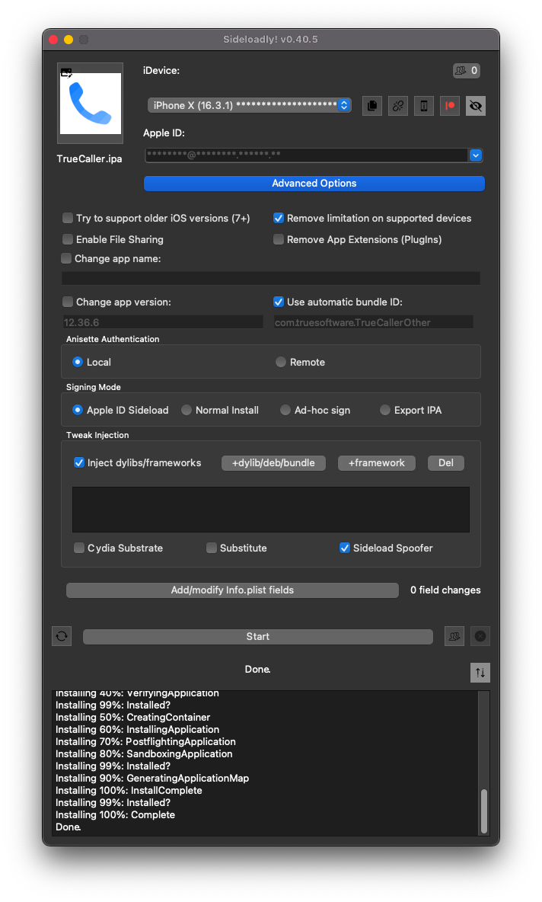

# frida-ios-dump
A tool for extracting decrypted IPA files from jailbroken devices.

## What's New?
This fork **no longer requires** using `scp`, unlike the original project. 
This is possible because I utilized the Frida [File API](https://frida.re/news/2022/07/06/frida-15-1-28-released/#:~:text=File%20API) to read all bytes inside a `Module` file and then parse it into a `MachO` object. 
Currently, this class does not implement all [Apple specifications](https://github.com/apple-oss-distributions/xnu/blob/main/EXTERNAL_HEADERS/mach-o/loader.h).

By doing this, the tool doesn't generate auxiliary files on the APFS filesystem, as they are only stored as `ArrayBuffer` (and [`node:Buffer`](https://nodejs.org/api/buffer.html)) in memory. 
After patching, I can send the file to PC/macOS using the [`send` Frida primitive](https://frida.re/docs/messages/).

Furthermore, this solution extends the [`ConsoleApplication`](https://github.com/frida/frida-tools/blob/1ea077fdb49440e5807cf25fae41e389e3d2bd4a/frida_tools/application.py#L124-L134) class, thereby avoiding issues with argument handling.

## Usage

To use frida-ios-dump, follow these steps:

1. Install [frida](http://www.frida.re/) on your device.
   > **Note**<br/>
   > [My repo](https://miticollo.github.io/repos/) is no more necessary because since Frida 16.1.5 supports rootless and rootfull JB.
   > Anyway if you want to compile your own Frida DEB you can follow/adapt [my guide](https://gist.github.com/miticollo/6e65b59d83b17bacc00523a0f9d41c11).
2. <span id="clone"></span>
   Clone this project by entering the following command in your terminal:
   ```shell
   git clone --depth=1 -j8 https://github.com/miticollo/frida-ios-dump.git
   cd frida-ios-dump/
   ```
3. Create a virtual environment.
   ```shell
   python -m venv ./.venv
   source ./.venv/bin/activate
   ```
4. Run `pip -vvv install frida-tools --upgrade` to install/upgrade the Frida dependency.
5. (Optional) Connect your iDevice to macOS/PC using a USB lightning cable.
   You can also decrypt iOS over Wireless using the remote communication provided by Frida, although USB is recommended.
6. Run the following commands to decrypt apps:
   - ```shell
     python ./decrypter.py -U -f com.google.ios.youtube
     ```
     This spawns YouTube and then decrypts it.
   - ```shell
     python ./decrypter.py -U -n Spotify 
     ```
     Use this after opening the Spotify app.


### How to install it?

To install the app, sideload it as follows:
- Use [Sideloadly](https://sideloadly.io/)
  
  > **Note**<br/>
  > Enable “Sideload Spoofer” as some apps may not work after decryption.

## Tested environment

- [Python3](https://github.com/pyenv/pyenv)

### Devices and iOS Versions

- iPhone XR with iOS 15.1b1 jailbroken using [Dopamine](https://github.com/opa334/Dopamine/releases/tag/1.1.5)
- iPhone X with iOS 16.3.1 rootfull JB

## References

- [Decrypting iPhone Apps](https://sensepost.com/blog/2011/decrypting-iphone-apps/)
- [Decrypting iOS Binaries](https://mandalorianblog.wordpress.com/2013/05/03/decrypting-ios-binaries/)
- [Basic iOS Testing Operations](https://github.com/carlospolop/hacktricks/blob/master/mobile-pentesting/ios-pentesting/basic-ios-testing-operations.md#decryption-manual)
- [r2con 2016: iOS Reverse Engineering](https://github.com/radareorg/r2con2016/blob/master/talks/04-r2clutch/r2con-r2clutch.pdf)
- [r2flutch](https://github.com/as0ler/r2flutch)
- [frida-ios-dump by AloneMonkey](https://github.com/AloneMonkey/frida-ios-dump)
- [bagbak by ChiChou](https://github.com/ChiChou/bagbak)
